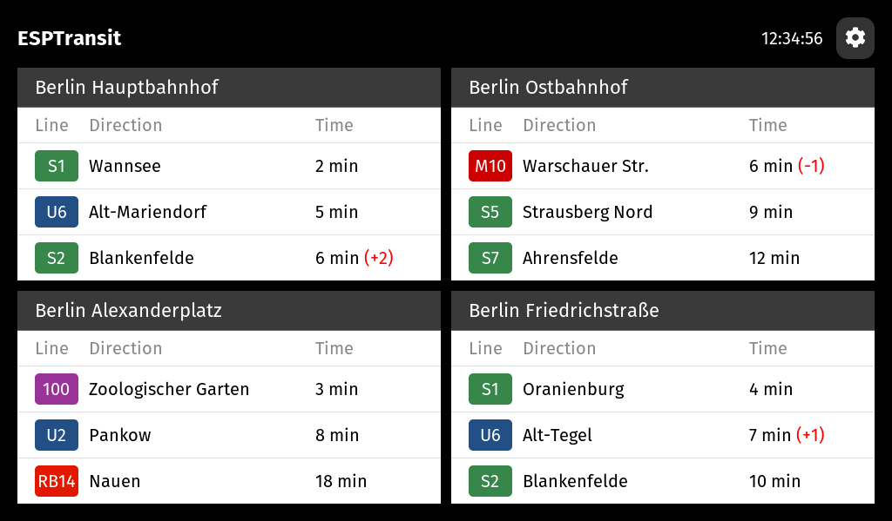

# ESPTransit

Open-source firmware that turns ESP32-P4 touchscreen boards into real-time departure displays for German rail and transit systems.

For documentation, visit [esptrans.it](https://esptrans.it).
